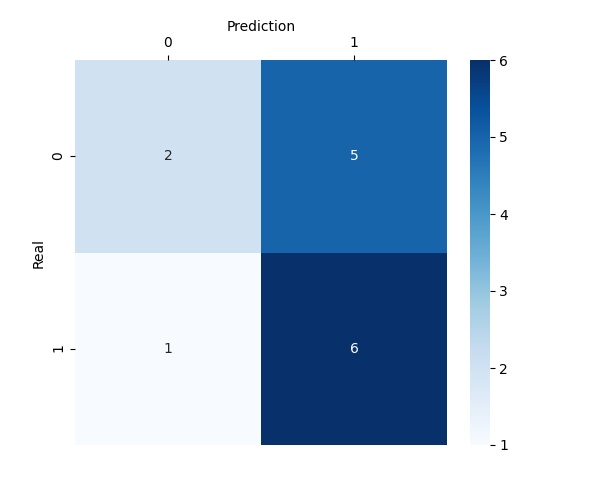
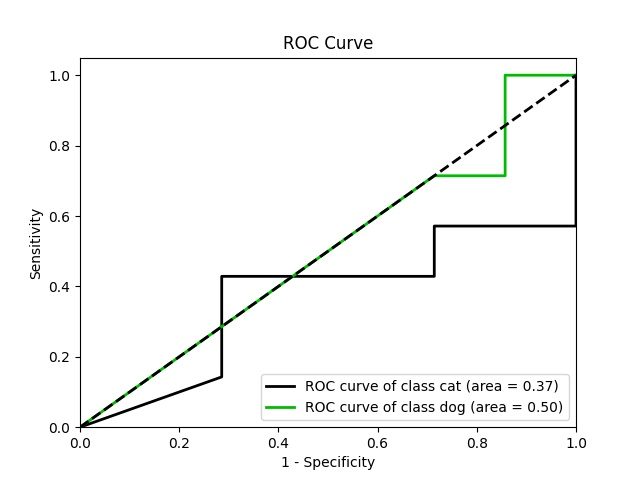
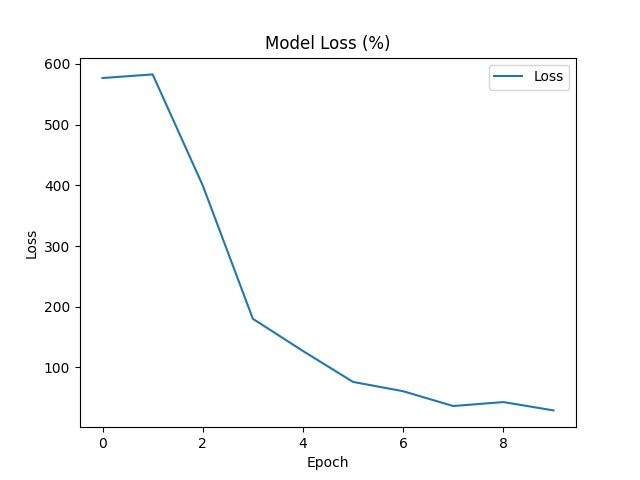
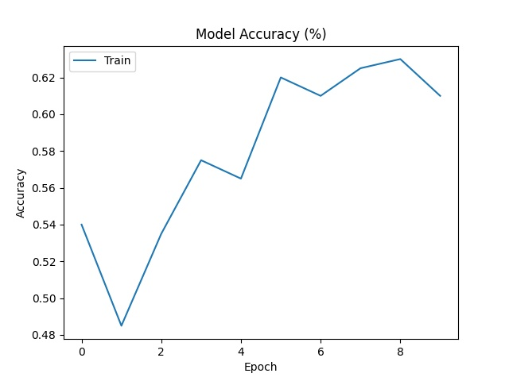

# PyImageClassification

<a href="https://www.codefactor.io/repository/github/yusufberki/pyimageclassification"></a>
<a href="https://github.com/YusufBerki/PyImageClassification/blob/master/LICENSE"></a>

Python-based dynamic image classification project where you can train using Tensorflow, Keras from 26 different transfer learning models, use callback function like TensorBoard visualization tool and get graphics such as Confusion Matrix,
ROC Curve.

## Table of Contents

1. [Introduction](#introduction)
1. [Requirements and Dependencies](#requirements-and-dependencies)
1. [Installation](#installation)
1. [Training](#training)
1. [Testing](#testing)
1. [Visualization](#visualization)
1. [Prediction API](#prediction-api)

## Introduction

The project allows you to use all available transfer learning models. As a result of the training, it produces the graphics in the literature for classification for you. Easy to use and open to customization with arguments.

You can check [To-Do](https://github.com/YusufBerki/PyImageClassification/projects/1) for features to be added to the project which is still under development.

## Requirements and Dependencies

[Python](https://www.python.org/) 3.7 or higher is required to run the project.

Check the [installation](#installation) for the required library installations.

## Installation

Clone the project with:

```sh
git clone https://github.com/YusufBerki/PyImageClassification.git
```

Change directory to project directory with:

```sh
cd PyImageClassification
```

:warning: It is recommended that you create a virtual environment at this stage.

After that to install the required libraries run the following code:

```sh
pip install -r requirements.txt
```

## Training

### Dataset Folder Structure

Go to the `dataset` folder located under the project directory. In the dataset folder, open two different folders as `train` and `test`. For your training data, first open a folder for each class in the train folder, then put the images of
each class in its own folder. Do the same for your test data inside the test folder.

In a case where you have two classes named `cat` and `dog`, the folder structure should be like this:

```
PyImageClassification
└─── dataset
    ├─── train
    │    ├─── cat   
    │    │    ├─── your_cat_image_01.jpg
    │    │    ├─── your_cat_image_02.jpg
    │    │    └─── ...
    │    │    
    │    └──── dog
    │         ├─── your_dog_image_01.jpg
    │         ├─── your_dog_image_02.jpg
    │         └─── ...
    │
    └─── test 
         ├─── cat   
         │    ├─── your_test_cat_image_01.jpg
         │    ├─── your_test_cat_image_02.jpg
         │    └─── ...
         │
         └─── dog
              ├─── your_test_dog_image_01.jpg
              ├─── your_test_dog_image_02.jpg
              └─── ...

```

### Data Generation

Generate batches of tensor image data with real-time data augmentation.

It allows using augmentation methods such as horizontal flip and vertical flip in real time. You can find more information about these methods
at [this](https://www.tensorflow.org/api_docs/python/tf/keras/preprocessing/image/ImageDataGenerator) link. Check [here](options/train_options.py) (lines after the comment line named `Data Generator`) for available arguments.

### Start Training

Basically you can start the training with:

``` sh
python train.py --model InceptionV3 --batch_size 16
```

### Training Arguments

Here are some arguments you can use for training:

| command               | type | default                  | description                                                                                                                 |
|-----------------------|------|--------------------------|-----------------------------------------------------------------------------------------------------------------------------|
| --model               | str  | InceptionV3              | The transfer learning model to be used                                                                                      |
| --target_size_x       | int  | 150                      | The dimension x to which all images found will be resized                                                                   |
| --target_size_y       | int  | 150                      | The dimension y to which all images found will be resized                                                                   |
| --batch_size          | int  | 16                       | Size of the batches of data.                                                                                                |
| --weights             | str  | imagenet                 | One of `None` (random initialization), 'imagenet' (pre-training on ImageNet), or the path to the weights file to be loaded. |
| --include_top         | bool | False                    | Whether to include the fully-connected layer at the top of the network.                                                     |
| --input_shape_x       | int  | 150                      | The width of the model input image. Only to be specified if `include_top` is `False`. Should be no smaller than 75.         |
| --input_shape_y       | int  | 150                      | The height of the model input image. Only to be specified if `include_top` is `False`. Should be no smaller than 75.        |
| --input_shape_channel | int  | 3                        | The number of channel of the model input image. Only to be specified if `include_top` is `False`.                           |
| --activation          | str  | softmax                  | Activation function for last layer                                                                                          |
| --fc_activation       | str  | relu                     | Activation function for fully connected layers.                                                                             |
| --optimizer           | str  | adam                     | Name of optimizer for compile the model                                                                                     |
| --loss                | str  | categorical_crossentropy | Name of objective function                                                                                                  |

To view all arguments, run this:

```sh
python train.py --help
```

or check [options](/options) folder

### Available Models

All [available models in Keras](https://keras.io/api/applications/) are supported.

|Model|Size|Top-1 Accuracy|Top-5 Accuracy|Parameters|Depth|
|--- |--- |--- |--- |--- |--- |
|Xception|88 MB|0.790|0.945|22,910,480|126|
|VGG16|528 MB|0.713|0.901|138,357,544|23|
|VGG19|549 MB|0.713|0.900|143,667,240|26|
|ResNet50|98 MB|0.749|0.921|25,636,712|-|
|ResNet101|171 MB|0.764|0.928|44,707,176|-|
|ResNet152|232 MB|0.766|0.931|60,419,944|-|
|ResNet50V2|98 MB|0.760|0.930|25,613,800|-|
|ResNet101V2|171 MB|0.772|0.938|44,675,560|-|
|ResNet152V2|232 MB|0.780|0.942|60,380,648|-|
|InceptionV3|92 MB|0.779|0.937|23,851,784|159|
|InceptionResNetV2|215 MB|0.803|0.953|55,873,736|572|
|MobileNet|16 MB|0.704|0.895|4,253,864|88|
|MobileNetV2|14 MB|0.713|0.901|3,538,984|88|
|DenseNet121|33 MB|0.750|0.923|8,062,504|121|
|DenseNet169|57 MB|0.762|0.932|14,307,880|169|
|DenseNet201|80 MB|0.773|0.936|20,242,984|201|
|NASNetMobile|23 MB|0.744|0.919|5,326,716|-|
|NASNetLarge|343 MB|0.825|0.960|88,949,818|-|
|EfficientNetB0|29 MB|-|-|5,330,571|-|
|EfficientNetB1|31 MB|-|-|7,856,239|-|
|EfficientNetB2|36 MB|-|-|9,177,569|-|
|EfficientNetB3|48 MB|-|-|12,320,535|-|
|EfficientNetB4|75 MB|-|-|19,466,823|-|
|EfficientNetB5|118 MB|-|-|30,562,527|-|
|EfficientNetB6|166 MB|-|-|43,265,143|-|
|EfficientNetB7|256 MB|-|-|66,658,687|-|

### Callback Functions

A callback is an object that can perform actions at various stages of training (e.g. at the start or end of an epoch, before or after a single batch, etc).

You can use callbacks to:

- Write TensorBoard logs after every batch of training to monitor your metrics
- Periodically save your model to disk
- Do early stopping
- Reduce learning rate when a metric has stopped improving.

Check [this](docs/callbacks.md) document for explanations and how to use callback functions

### Resume Training

If you stopped the training and want to resume from the epoch you left off, you need to set the `--resume` argument as `True` and set the `--results_dir` argument as your training folder in the `results` folder.

**Note:** In order to save weights in each epoch, the `--model_checkpoint` value must be set to `True` in the first training. The `checkpoints` folder in `--results_dir` is used to resume the training. 
The records in this folder are
named `epoch_01_` by default. Based on these names, the weights are loaded for the **last** epoch.

A sample code block to continue the training is as follows:

```sh
python train.py --resume True --results_dir results\InceptionV3_2021_07_31_14_20
```

## Testing

After the training is completed, a new folder will be created in the [`results`](results/) folder. The folder is named like `{algorithm_name}_{training_date}`
(e.g. `InceptionV3_2021_07_31_14_20`).

Models and history saved in the folder will be used in the testing. In an example where the folder name is `InceptionV3_2021_07_31_14_20`, the test code would be:

```sh
python test.py --results_dir InceptionV3_2021_07_31_14_20
```

When the code is successfully run and complete, it will be in your `results` folder as follows:

```
PyImageClassification
└─── results
    └─── InceptionV3_2021_07_31_14_20
         ├─── charts   
         │    ├─── accuracy.jpg
         │    ├─── confusion_matrix.jpg
         │    ├─── loss.jpg
         │    └─── roc_curve.jpg
         │    
         └──── prediction_results.xlsx
```

You can view the prediction results in the `prediction_results.xlsx` file as follows:

|image|real|prediction|
|--- |--- |--- |
cat\cat.0.jpg| cat| cat
cat\cat.1.jpg| cat| dog
dog\dog.0.jpg| dog| dog
dog\dog.1.jpg| dog| dog

## Visualization

After the `test.py` is successfully completed, the `charts` folder will be created in your `results` folder.

Inside the `charts` folder you can view these 4 charts:

#### 1 - Confusion Matrix



#### 2 - ROC Curve



#### 3 - Loss



#### 4 - Accuracy



## Prediction API

Use the model you have trained with a web API. Check [this](prediction_api/) page for a [django](https://www.djangoproject.com/) application where you can classify images with web API developed
with [Django REST Framework](www.django-rest-framework.org/).

## Contact

[Yusuf Berki YAZICIOĞLU](mailto:mail@yusufberki.net)

## License

See [MIT License](/LICENSE)
