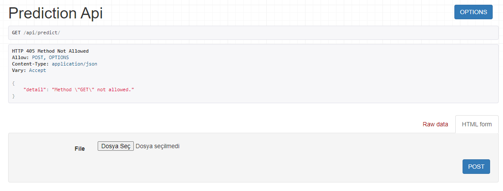
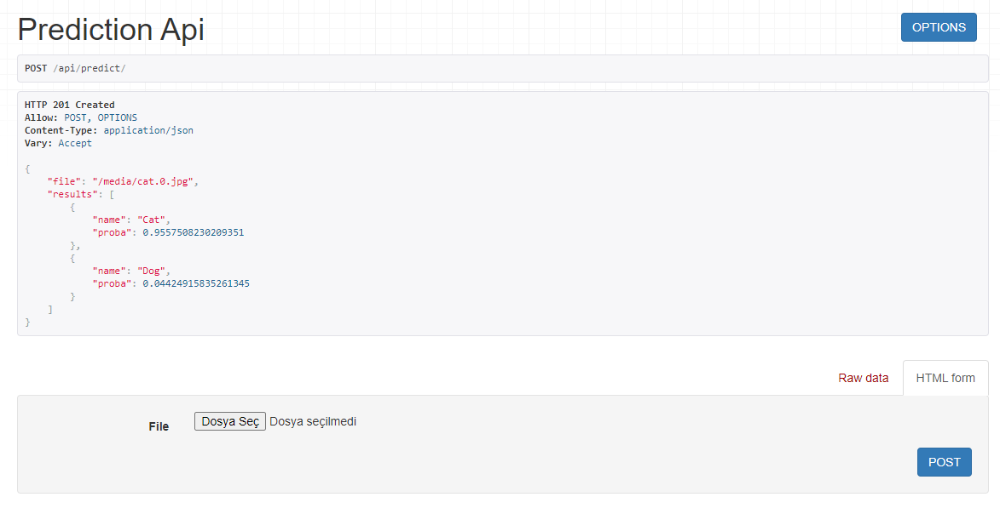

# Prediction API

Prediction API is a [django](https://www.djangoproject.com/) application where you can classify images with web API developed with [Django REST Framework](www.django-rest-framework.org/). The model is loaded when you run the Django application. In this way, you save time during prediction.

## Installation

Go to the `prediction_api` folder with:

```sh
cd $YOUR_PROJECT_DIR/prediction_api
```

It is assumed that you have already installed the
[requirements.txt](../requirements.txt) located in the project's home directory. 
These [requirements.txt](requirements.txt) file only contain the requirements for the django application.

Install the required libraries for the Django application:

```sh
pip install -r requirements.txt
```

Run the following code to load the rest framework's static files:

```sh
python manage.py collectstatic
```

Run the following code for database migration:

```sh
python manage.py migrate
```

Edit [this](prediction/src/opt.py) file to enter the model path, the required size of the images, and the class names. It should be like this:

```py
model_path = '$YOUR_PRROJECT_DIR/results/$YOUR_TRAINING_DIR/model/model.h5'
image_shape = (150, 150, 3)
classes = ['Cat', 'Dog']
```

## Usage

Run the following code for start the Django server:

```
python manage.py runserver
```

When it runs successfully, it outputs something like this:

```
...

Model successfully loaded!

System check identified no issues (0 silenced).

Django version 3.2.5, using settings 'config.settings'
Starting development server at http://127.0.0.1:8000/
Quit the server with CTRL-BREAK.
```

Add `/api/predict/` to the link where the server is started for open the API interface (e.g. http://127.0.0.1:8000/api/predict/)

### API Interface

The API interface looks like this:


When you select the image you want to predict and press the `POST` button, it looks like this:


### Curl Example

```curl
curl --location --request POST 'http://127.0.0.1:8000/api/predict/' --form 'file=@"filename.jpg"'
```

### Python Example

```python
import requests

url = "http://127.0.0.1:8000/api/predict/"

files = [
    (
        'file',
        ('filename.jpg', open('/DIRECTORY/filename.jpg', 'rb'), 'image/jpeg')
    )
]

response = requests.request("POST", url, files=files)

print(response.json())
```

# API Response
The API response includes the uploaded filename and prediction results with probabilities.
Prediction results are ordered with the highest probability first. 

Sample response:
```json
{
  "file": "/media/cat.0_LbJyBE1.jpg",
  "results": [
    {
      "name": "Cat",
      "proba": 0.9557508230209351
    },
    {
      "name": "Dog",
      "proba": 0.04424915835261345
    }
  ]
}
```
