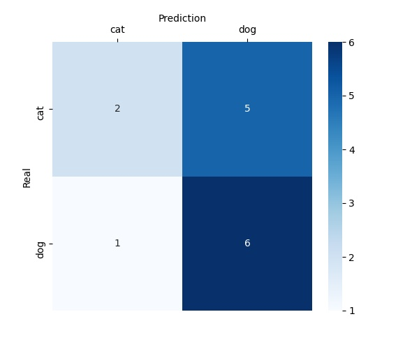
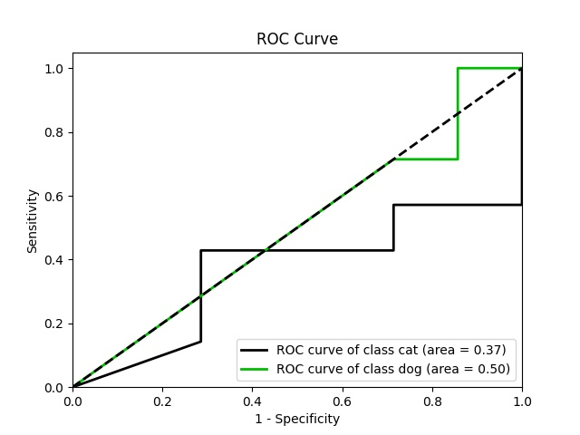

# Results
After the training is completed, a new folder will be created in the `results` folder. 
The folder is named like `{algorithm_name}_{training_date}`
(e.g. `InceptionV3_2021_07_31_14_20`). Inside this folder will be the `model.h5` and `history.json` files


When the test code is successfully run and complete, 
it will be in your `results` folder as follows:

```
PyImageClassification
└─── results
    └─── InceptionV3_2021_07_31_14_20
         ├─── charts   
         │    ├─── accuracy.jpg
         │    ├─── confusion_matrix.jpg
         │    ├─── loss.jpg
         │    ├─── roc_curve.jpg
         │    
         └──── prediction_results.xlsx
```

You can view the prediction results in the `prediction_results.xlsx` file as follows:

|image|real|prediction|
|--- |--- |--- |
cat\cat.0.jpg| cat| cat
cat\cat.1.jpg| cat| dog
dog\dog.0.jpg| dog| dog
dog\dog.1.jpg| dog| dog

# Testing

After the training is completed, a new folder will be created in the `results` folder. The folder is named like `{algorithm_name}_{training_date}`
(e.g. `InceptionV3_2021_07_31_14_20`).

Models and history saved in the folder will be used in the testing. In an example where the folder name is `InceptionV3_2021_07_31_14_20`, the test code would be:

```sh
python test.py --results_dir InceptionV3_2021_07_31_14_20
```

When the code is successfully run and complete, it will be in your `results` folder as follows:

```
PyImageClassification
└─── results
    └─── InceptionV3_2021_07_31_14_20
         ├─── charts   
         │    ├─── accuracy.jpg
         │    ├─── confusion_matrix.jpg
         │    ├─── loss.jpg
         │    └─── roc_curve.jpg
         │    
         └──── prediction_results.xlsx
```

You can view the prediction results in the `prediction_results.xlsx` file as follows:

|image|real|prediction|
|--- |--- |--- |
cat\cat.0.jpg| cat| cat
cat\cat.1.jpg| cat| dog
dog\dog.0.jpg| dog| dog
dog\dog.1.jpg| dog| dog


# Visualization
After the `test.py` is successfully completed, 
the `charts` folder will be created in your `results` folder.

Inside the `charts` folder you can view these 4 charts:

## 1 - Confusion Matrix

## 2 - ROC Curve

## 3 - Loss

## 4 - Accuracy


